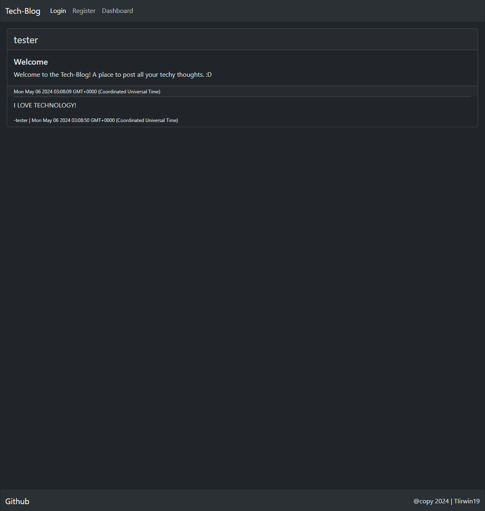
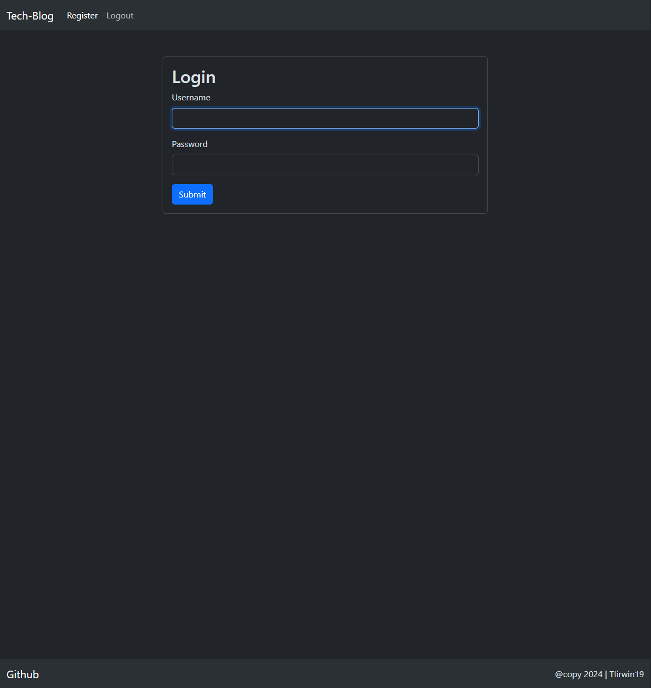
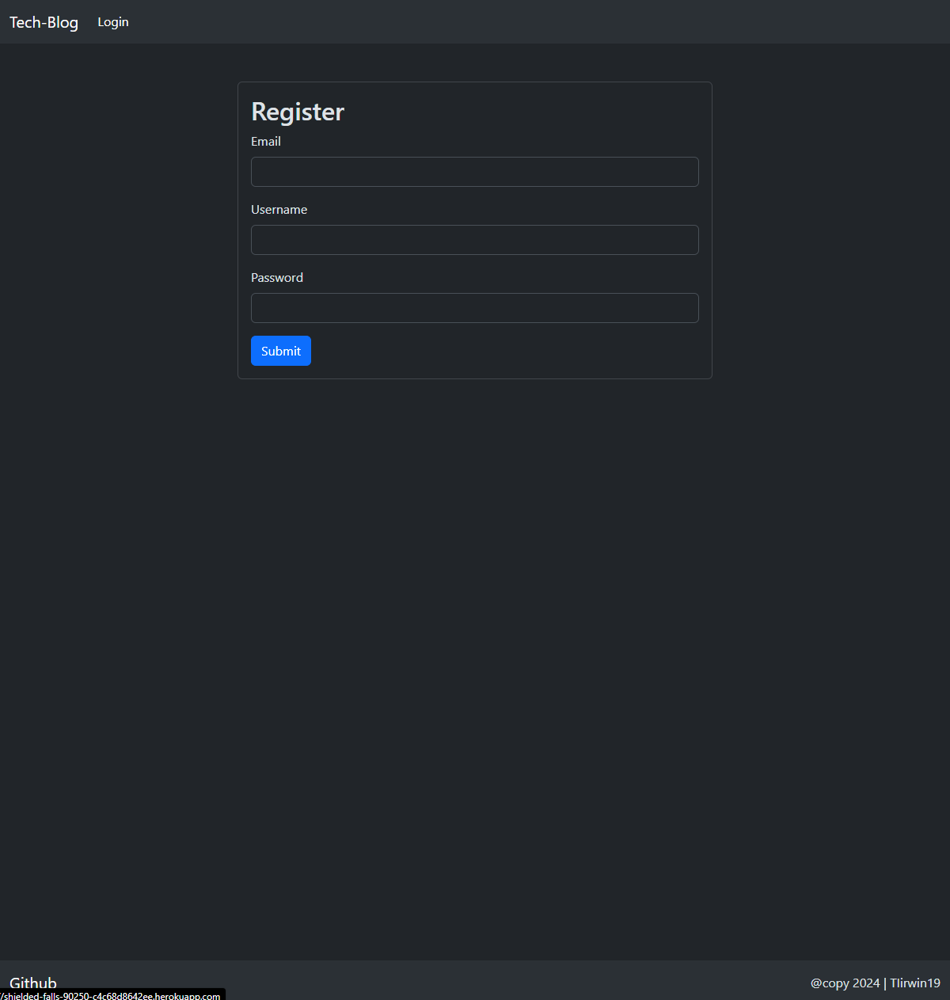
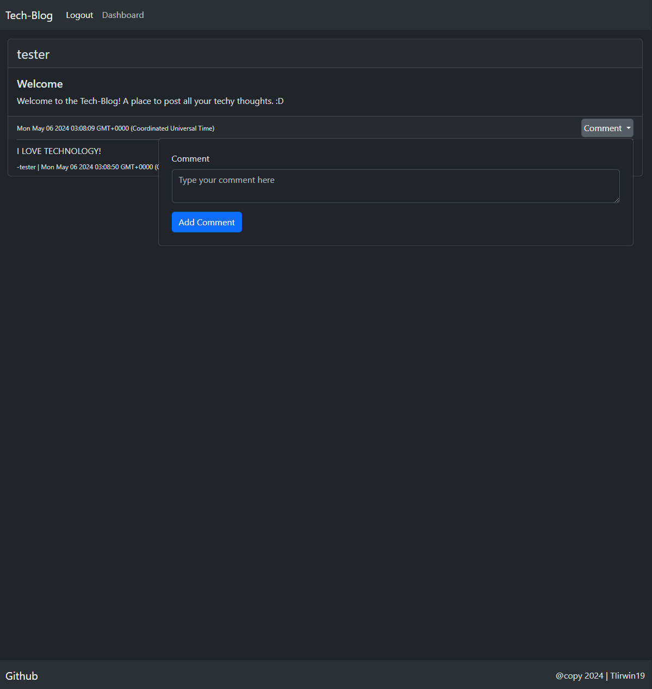
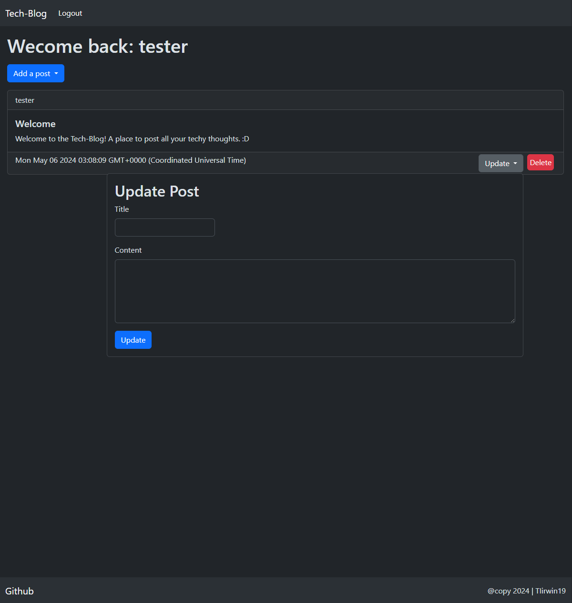

# MVC Tech-Blog

## Description
The Tech-Blog is a place to share all your thoughts and insights on tech. Its accessable to view by anyone but if you register you can make and keep track of edit and delete your own posts and also comment on other users posts.

## Table of Contents
- [Usage](#usage)
- [Credits](#credits)
- [License](#license)
- [How to Contribute](#how-to-contribute)
- [Tests](#tests)
- [Questions](#questions)

## Visuals

## Usage 
First you can click the link further down in this Readme to go to the website. Once there you'll notice user posts and the comments associated with them. By clicking on the "Register" button in the header you can make an account. Make sure you save or write down your password there is no recovery at this time. Once registered you will be redirected back to the home page but this time you will be able to comment on other users posts by clicking the "comment" dropdown button. In order to create a post of your own you can go to clock the Dashboard button in the header. Once there you can create a new post by clicking "Add Post". You'll notice your post pop up on the dashboard and there will be an "Update" and "Delete" button. These buttons wil allow you to edit and delete posts you've made. If at any time you want to logout you can click the "Logout" button in the header otherwise you will be autimatically logged out after 3min of inactivity.

## Deployed Link
https://shielded-falls-90250-c4c68d8642ee.herokuapp.com/

## Credits
JD Tadlock: for all the Instruction in the Rutgers coding Bootcamp

## License
#### MIT
A short and simple permissive license with conditions only requiring preservation of copyright and license notices. Licensed works, modifications, and larger works may be distributed under different terms and without source code.
[Link to License](https://opensource.org/license/MIT)
You can also check out the LICENSE in the repo.

## How to Contribute
Check out the [Contributor Covenant](https://www.contributor-covenant.org/version/2/1/code_of_conduct/code_of_conduct.md)

## Tests
none

## Questions
If you have any questions check out my [Github](https://github.com/TIrwin19) or send me an email at N/A.

